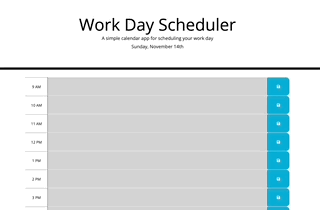

# work-day-scheduler

This weeks homework assignment was to create a simple calendar application that allows a user to save events for each hour of the day by modifying starter code. Most of the code was provided other than the JS. To start I added the bootstrap timeblocks to the HTML file. After getting those setup to resemble to mockup I then went to work on the JS file. The first thing I did in the JS file was use moment.js to display the current weekday, month, and numerical day. Then I created a var to store the current time which I used in my function to update the timeblock colors. Lastly I created a function to save the user's input to local storage so that it is saved if the page is refreshed or closed.

[scheduler live link](https://masonfibkins.github.io/work-day-scheduler/)

